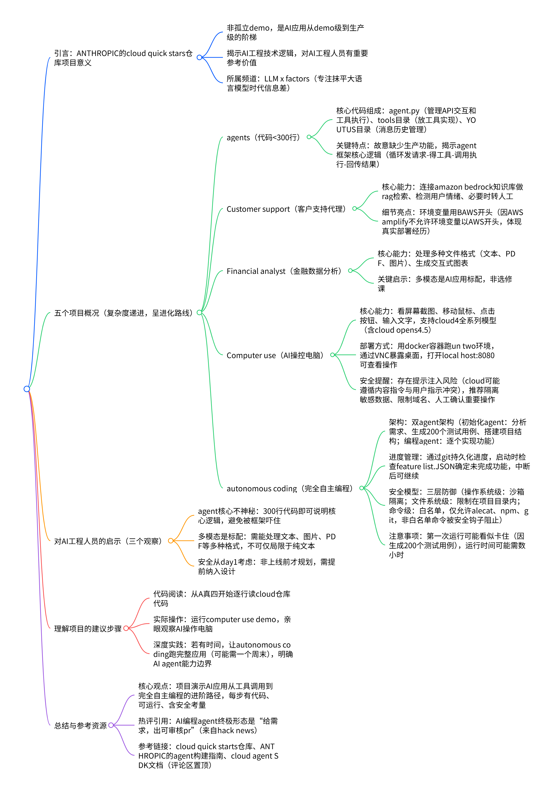

* 核心主题：ANTHROPIC的cloud quick stars仓库项目分析（从demo到生产级AI应用的进化路线）
  * 一、项目整体定位与价值
    * 非孤立demo，是精心设计的“技术阶梯”
    * 核心目标：展示AI应用从demo级到生产级的实现路径
    * 关联频道：LLM x factors（专注抹平大语言模型时代信息差）
  * 二、五个项目详情（按复杂度递进排序）
    * * agents（基础工具调用）
      * * 代码规模：不到300行
        * 核心组成：agent.py（管理API交互+工具执行）、tools目录（工具实现）、YOUTUS目录（消息历史管理）
        * 关键特点：故意缺少生产功能，凸显agent核心逻辑（循环：发请求→得工具→调用执行→返结果）
        * 底层逻辑：与LangChain、Londex、AutoGPT一致，框架仅提效，核心需自主理解
    * * Customer support（RAG检索应用）
      * * 核心能力：客户支持代理，连接Amazon Bedrock知识库做RAG检索，可检测用户情绪、转人工
        * 细节亮点：环境变量用BAWS开头（因AWS Amplify不允许AWS开头，体现真实部署经验）
    * * Financial analyst（多模态分析）
      * * 核心能力：处理多格式文件（文本、PDF、图片），生成交互式图表
        * 关键结论：多模态是AI应用标配，非选修课
    * * Computer use（计算机控制）
      * * 核心能力：让AI操控电脑（看截图、移动鼠标、点击、输入文字），支持Claude 4全系列（含Claude Opus 4.5）
        * 部署方式：用Docker容器跑Ubuntu环境，通过VNC暴露桌面，访问localhost:8080可查看
        * 安全风险：存在提示注入风险（Claude可能遵循网页恶意指令，与用户指示冲突）
        * 安全建议：隔离敏感数据、限制允许域名、重要操作人工确认
    * * Autonomous coding（完全自主编程）
      * * 架构设计：双agent架构（初始化agent：分析需求、生成200个测试用例、搭项目结构；编程agent：逐个实现功能）
        * 进度管理：通过Git持久化，启动时检查feature list.json确定未完成功能，中断后可继续，运行需数小时（首次运行似“卡住”是因生成测试用例）
        * 安全模型：三层防御（操作系统级：沙箱隔离；文件系统级：限制在项目目录；命令级：白名单仅允许alecat、npm、git，非白名单命令被安全钩子阻止）
  * 三、核心观察与启示
    * agent核心不神秘：300行代码可清晰呈现核心逻辑，无需被框架吓住
    * 多模态是标配：需支持文本、图片、PDF等多格式处理，不可仅局限于纯文本
    * 安全需前置：从项目启动（day1）就考虑安全，而非上线前临时应对
  * 四、实践建议（理解项目的操作步骤）
    * 代码阅读：从agents项目开始逐行读cloud仓库代码
    * demo体验：运行Computer use demo，观察AI操作电脑过程
    * 完整实践：若有时间，让Autonomous coding跑一个完整应用（需1个周末），明确AI agent能力边界
  * 五、总结与参考资源
    * 核心结论：项目展示AI应用进化路线（工具调用→RAG→多模态→电脑操控→自主编程），每步均有可运行代码与安全考量
    * 经典评价：Hack News热评“编程agent终极形态：输入需求，输出可审核的PR”
    * 参考链接：cloud quick starts仓库、ANTHROPIC的agent构建指南、cloud agent SDK文档（评论区置顶）
      

